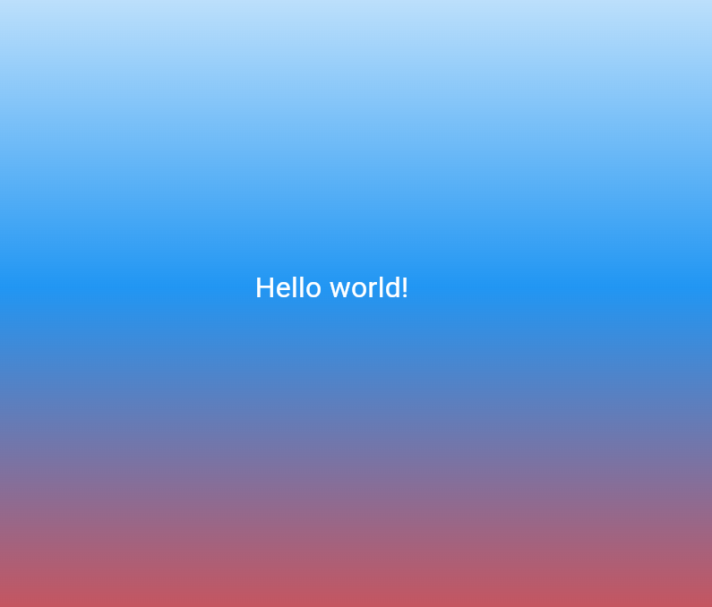

# Лабораторная работа №2. Знакомство с Flutter
## Кузьмина Диана ИСП-232
___

**Flutter** — это открытый кроссплатформенный UI-фреймворк, разработанный
компанией Google. Он позволяет писать один код на языке Dart и собирать из него
нативные приложения для шести платформ одновременно: Android, iOS, Web,
Windows, macOS и Linux.
В отличие от React Native или Ionic, Flutter не использует нативные компоненты
платформы и не создаёт мост к ним. Вместо этого Flutter рисует весь интерфейс
самостоятельно через собственный графический движок Skia / Impeller. Это даёт
пиксельно-точный одинаковый UI на любой платформе и высокую
производительность (60/120 fps).